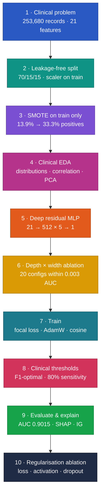

# Deep Residual MLP for Diabetes Risk Prediction


Can a deep network screen for diabetes from **survey answers alone**? This project builds a residual multilayer perceptron in PyTorch on **253,680 CDC BRFSS 2015 records**, handles the 13.9% class imbalance without leaking information into evaluation, chooses clinically meaningful decision thresholds, and explains every prediction with SHAP and Integrated Gradients.

> MSc Data Science project, University of Hertfordshire. A full written report is in [`reports/`](reports/Deep_Residual_MLP_Report.pdf).

---

## Highlights

| | |
|---|---|
| **Discrimination** | Test **AUC 0.9015**, average precision 0.6703 |
| **Screening mode** | **81.4% sensitivity** with negative predictive value **0.965** (threshold 0.35, chosen on validation) |
| **Calibration** | Brier score **0.0937** |
| **No leakage** | Split → scale → SMOTE on train only; every validation-test gap below 0.01 |
| **Explainability** | SHAP and Integrated Gradients agree: BMI, general health, high blood pressure, age, cholesterol |
| **Honest ablations** | 20 architectures and 13 regularisation variants show capacity is not the bottleneck - dropout is what matters |

## Methodology


**[Explore the interactive methodology](https://spoorthihs4-ops.github.io/diabetes-risk-deep-residual-mlp/)** – click any stage to see what it does, why it matters, the result it produced and the techniques behind it.

<details>
<summary><b>Pipeline as a live diagram (zoom and pan on GitHub)</b></summary>


</details>

## Results

### Test set (38,052 records, real 13.9% prevalence)

| Metric | Default (0.50) | F1-optimal (0.45) | Screening (0.35) |
|---|---|---|---|
| Sensitivity | 0.521 | 0.629 | **0.814** |
| Specificity | 0.962 | 0.933 | 0.827 |
| Precision | 0.691 | 0.603 | 0.431 |
| NPV | 0.926 | 0.940 | **0.965** |
| F1 (diabetic) | 0.594 | **0.616** | 0.564 |
| MCC | 0.546 | **0.553** | 0.504 |

Threshold-free: **AUC 0.9015 · average precision 0.6703 · Brier 0.0937**. Both thresholds were chosen on validation data before the test set was used.

<p align="center">
  
  
</p>

### What the ablations showed

| Study | Finding |
|---|---|
| Depth × width (20 configs) | All within **0.003 AUC** (0.9006-0.9036); a 12k-parameter model scores 0.9031 |
| Dropout | Removing dropout drops AUC to **0.8722**; 0.3-0.4 works best |
| Loss | Focal loss and standard BCE tie on AUC (0.9022); weighted BCE needs threshold tuning |
| Activation | GELU, ReLU, Mish and SELU all within 0.002 AUC |

The takeaway: with 21 self-reported features, **performance is limited by the information in the data, not the size of the network**. The biggest practical gains came from leakage-free evaluation and a clinically chosen threshold.

<p align="center">
  
</p>

## Notebooks

| Notebook | Contents |
|---|---|
| [`00_full_pipeline_run_all`](notebooks/00_full_pipeline_run_all.ipynb) | **Everything, top to bottom - run this to reproduce** |
| [`01_data_preprocessing_and_eda`](notebooks/01_data_preprocessing_and_eda.ipynb) | Objectives, dataset, leakage-free split, scaling, SMOTE, EDA |
| [`02_model_and_depth_width_ablation`](notebooks/02_model_and_depth_width_ablation.ipynb) | Residual MLP, focal loss, utilities, 20-configuration ablation |
| [`03_training_and_threshold_optimisation`](notebooks/03_training_and_threshold_optimisation.ipynb) | Full training, curve dashboard, clinical thresholds |
| [`04_evaluation_and_explainability`](notebooks/04_evaluation_and_explainability.ipynb) | Test metrics, evaluation panels, SHAP, Integrated Gradients, val-test audit |
| [`05_regularisation_ablation_and_conclusions`](notebooks/05_regularisation_ablation_and_conclusions.ipynb) | Loss, activation and dropout ablations, limitations, conclusions |

## Reproduce

1. Download `diabetes_binary_health_indicators_BRFSS2015.csv` from the [Diabetes Health Indicators dataset](https://www.kaggle.com/datasets/alexteboul/diabetes-health-indicators-dataset) and place it next to the notebook.
2. `pip install -r requirements.txt`
3. Run [`00_full_pipeline_run_all.ipynb`](notebooks/00_full_pipeline_run_all.ipynb) top to bottom. It runs on CPU; the full training took about 29 minutes.

## Limitations

Self-reported, cross-sectional survey data with no laboratory biomarkers (HbA1c, glucose); pre-diabetes and diabetes are merged into one label; exact duplicate survey rows are not removed before splitting; subgroup fairness has not yet been audited.

## Repository structure

```
diabetes-risk-deep-residual-mlp/
├── notebooks/            # 00 full pipeline + 01-05 part notebooks (with outputs)
├── reports/              # written report (PDF + Word) and figures
├── docs/index.html       # interactive methodology (GitHub Pages)
├── requirements.txt
└── README.md
```

## Author

**Dr. Spoorthi H S** · MSc Data Science, University of Hertfordshire  
[LinkedIn](https://linkedin.com/in/dr-spoorthi-2005b6351) · [GitHub](https://github.com/spoorthihs4-ops)
